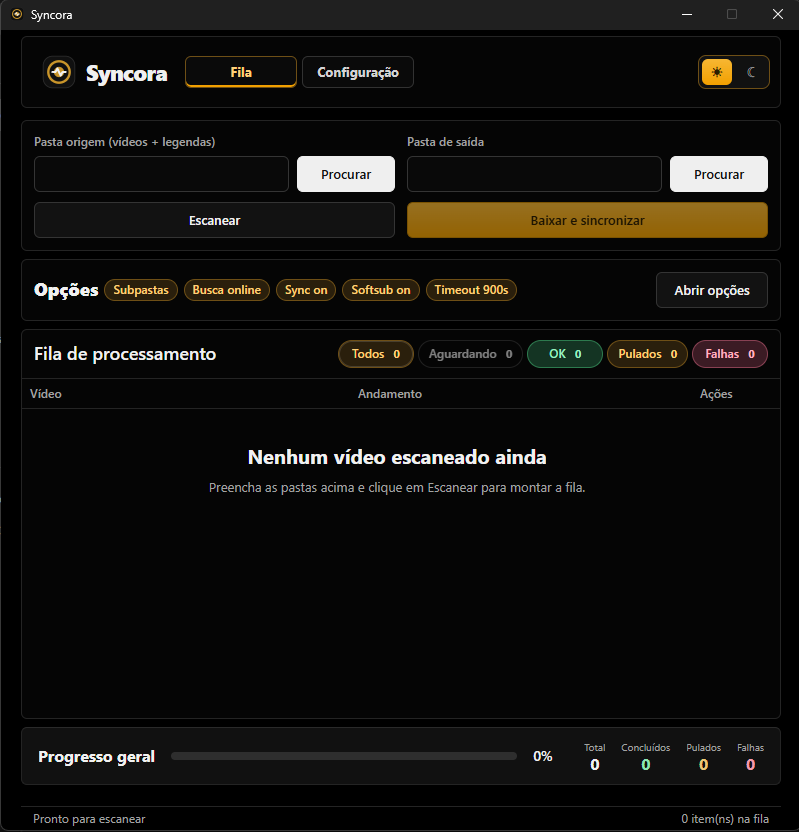
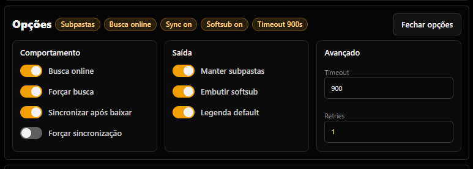
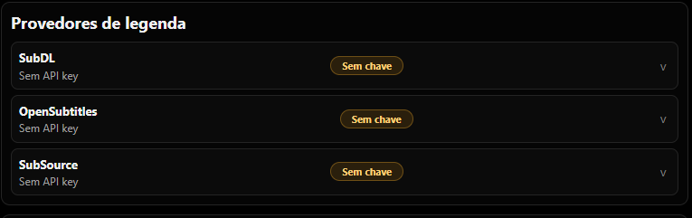
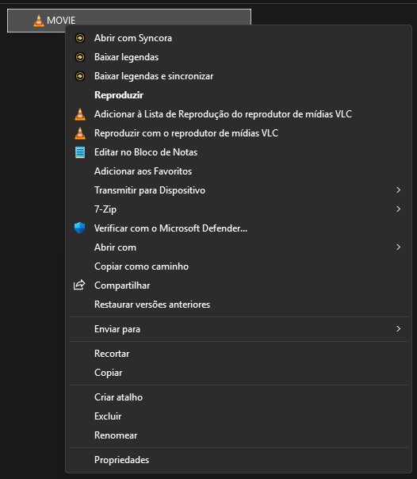

<p align="center">
  
</p>

<h1 align="center">Syncora</h1>

<p align="center">
  App desktop para encontrar, baixar e sincronizar legendas de arquivos de vídeo.
  <br />
  Tauri + React + FastAPI, com instalador nativo para Windows.
</p>

<p align="center">
  <a href="LICENSE"></a>
  
  
  <a href="https://github.com/CRaulD/Syncora/releases"></a>
</p>

---

## Visão geral

Syncora escaneia uma pasta (ou arquivos enviados pelo Explorer), busca legendas em provedores configurados, baixa e sincroniza com o vídeo usando **ALASS**. Opcionalmente, embute softsubs no arquivo final com **FFmpeg**/**FFprobe**.



## Recursos

- Busca online em provedores: **SubDL**, **OpenSubtitles** e **SubSource**.
- Sincronização automática de legenda com o vídeo (ALASS).
- Embutir softsubs no contêiner de saída (FFmpeg/FFprobe).
- Fila de processamento com status, retentativas e progresso geral.
- **Instalador único** (`syncora.exe`): o mesmo binário é o assistente de instalação e o app. Detecta primeira execução vs. já instalado via arquivo `.installed` e chave de registro.
- **Verificação automática de atualizações** via GitHub Releases, com cache de 24h e toast não-bloqueante quando há nova versão.
- Integração com o menu de contexto do Explorer:
  - **Abrir com Syncora**
  - **Baixar legendas**
  - **Baixar legendas e sincronizar**







## Instalação (usuário final)

Baixe o `syncora.exe` da [página de releases](https://github.com/CRaulD/Syncora/releases) e execute. O assistente de instalação (4 passos) cuida de:

1. **Termos de Uso** — aceite obrigatório para prosseguir.
2. **Preparar** — escolha o destino da instalação (padrão: `%LOCALAPPDATA%\Programs\Syncora`) e as opções (dependências, menu do Explorer).
3. **Instalar** — barra de progresso com etapa atual e percentual.
4. **Concluir** — abre o app.

A instalação é **por usuário** (HKCU + `%LOCALAPPDATA%`), sem prompt de UAC. Para desinstalar, use "Desinstalar o Syncora" no Menu Iniciar, ou Aplicativos instalados do Windows.

## Requisitos para desenvolvimento

| Ferramenta | Versão | Uso |
|---|---|---|
| Node.js | 18+ | Build do frontend (Vite + React + TypeScript) |
| Rust | 1.77+ | Build do Tauri e do helper do Explorer |
| Python | 3.10+ | Empacotamento do backend (FastAPI) via PyInstaller |

## Desenvolvimento

```powershell
npm install
npm run tauri:dev
```

O app sobe a interface React e inicia o backend Python automaticamente na porta `8765`.

Para rodar só o backend manualmente:

```powershell
cd backend
py -m pip install -r requirements.txt
py -m uvicorn server:app --host 127.0.0.1 --port 8765 --reload
```

## Build

Build do instalador único (`syncora.exe` com frontend e backend embarcados, sem instalador NSIS/MSI):

```powershell
npm run build:syncora
```

Saída: `src-tauri\target\release\syncora.exe` (~12 MB).

> O comando `tauri build --no-bundle` é usado para gerar o `.exe` único. Para gerar instaladores tradicionais (`.msi` / `.exe` NSIS), use `npm run tauri:build`.

### Backend empacotado

O backend Python é empacotado com PyInstaller em `backend\dist\syncora-backend.exe` (~50 MB) e embutido como recurso do Tauri. O build completo (`build:syncora`) cuida de tudo automaticamente.

## Provedores de legenda

Os provedores são configurados na aba **Configuração** do app. Cada um pode exigir uma **API key** (e opcionalmente usuário e senha) e tem limites próprios de uso:

- **SubDL** — API key obrigatória.
- **OpenSubtitles** — API key obrigatória; usuário e senha opcionais para validar conta e limites.
- **SubSource** — API key.

> As chaves são salvas localmente no app e nunca são enviadas a nenhum servidor além do provedor correspondente.

## Dados locais

Chaves de provedores, dependências baixadas (ALASS, FFmpeg, FFprobe) e estado do app ficam fora do repositório, em:

```text
%LOCALAPPDATA%\Syncora\runtime
%LOCALAPPDATA%\app.syncora.desktop\         # Tauri local data (cache do update checker, .installed, logs)
%APPDATA%\Syncora\                          # registry HKCU\Software\Syncora e HKCU\...\Uninstall\Syncora
```

## Atualizações

O app consulta a API do GitHub Releases (`api.github.com/repos/CRaulD/Syncora/releases/latest`) ao iniciar (1.5s após carregar) e exibe um toast amber no canto inferior direito quando uma nova versão está disponível. O cache de 24h evita bater no rate limit do GitHub (60 req/hora para chamadas não autenticadas). É possível forçar uma nova checagem em **Configuração → Atualizações → Verificar agora**.

Para que o update check funcione corretamente, o repositório precisa ter pelo menos uma release publicada (a `v0.1.0-beta` no caso desta versão).

## Estrutura do projeto

```
.
├── src/                  # Frontend React + Vite + TypeScript
│   ├── components/       # Componentes reutilizáveis (SetupWizard, etc.)
│   ├── locales/          # Traduções i18n (pt-BR, en, es)
│   └── styles/           # CSS (App + instalador)
├── src-tauri/            # App Tauri (Rust)
│   ├── src/              # lib.rs (app), setup_installer.rs (instalador)
│   ├── icons/            # Ícones do app
│   └── capabilities/     # Permissões do Tauri
├── backend/              # Backend Python (FastAPI) + empacotamento PyInstaller
├── scripts/              # Scripts PowerShell (build, contexto do Explorer)
└── docs/                 # Documentação legal, screenshots, plano
```

## Licença

MIT — veja [LICENSE](LICENSE).

## Documentos legais

- **Termos de Uso** — [pt-BR](docs/terms/pt-BR.md) · [en](docs/terms/en.md) · [es](docs/terms/es.md)
- **Política de Privacidade** — [pt-BR](docs/privacy/pt-BR.md) · [en](docs/privacy/en.md) · [es](docs/privacy/es.md)
